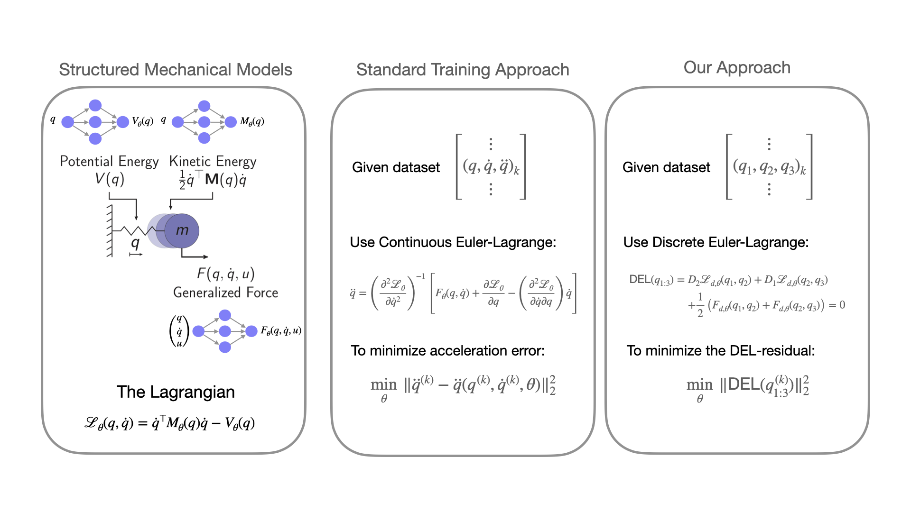

[Training Structured Mechanical Models by Minimizing Discrete Euler-Lagrange Residual](https://arxiv.org/abs/xxx) 
=======
Kunal Menda, Jayesh K. Gupta, Zachary Manchester, Mykel J. Kochenderfer



* [Paper](https://arxiv.org/abs/xxx)
* [Self-Contained Tutorial](https://github.com/sisl/delsmm/blob/repoprep/examples/DoublePendulumExample.ipynb)

## Abstract
Model-based paradigms for decision-making and control are becoming ubiquitous in robotics. They rely on the ability to efficiently learn a model of the system from data. Structured Mechanical Models (SMMs) are a data-efficient black-box parameterization of mechanical systems, typically fit to data by minimizing the error between predicted and observed accelerations or next states. In this work, we propose a methodology for fitting SMMs to data by minimizing the discrete Euler-Lagrange residual. To study our methodology, we fit models to joint-angle time-series from undamped and damped double-pendulums, studying the quality of learned models fit to data with and without observation noise. Experiments show that our methodology learns models that are better in accuracy to those of the conventional schemes for fitting SMMs. We identify use cases in which our method is a more appropriate methodology.

## Getting started
Clone `delsmm` and pip install the module.
```
cd delsmm
pip install -e .
```

## Codebase Overview
- `delsmm`: contains the source code, including the `StructuredMechanicalModel` class, training criteria, and regularization criterion.
- `examples`: contains a Jupyter notebook containing a minimal example of how to smooth data and fit an SMM to it by minimizing the discrete Euler-Lagrange residual.
- `experiments`: contains scripts to run the experiments in the paper and plot the results.
- `datagen`: contains scripts to generate example dat

## Dependencies
- PyTorch
- [CEEM](https://github.com/sisl/CEEM)
- Numpy
- Scipy
- PyKalman (for smoothing)
- Matplotlib (for visualization)
